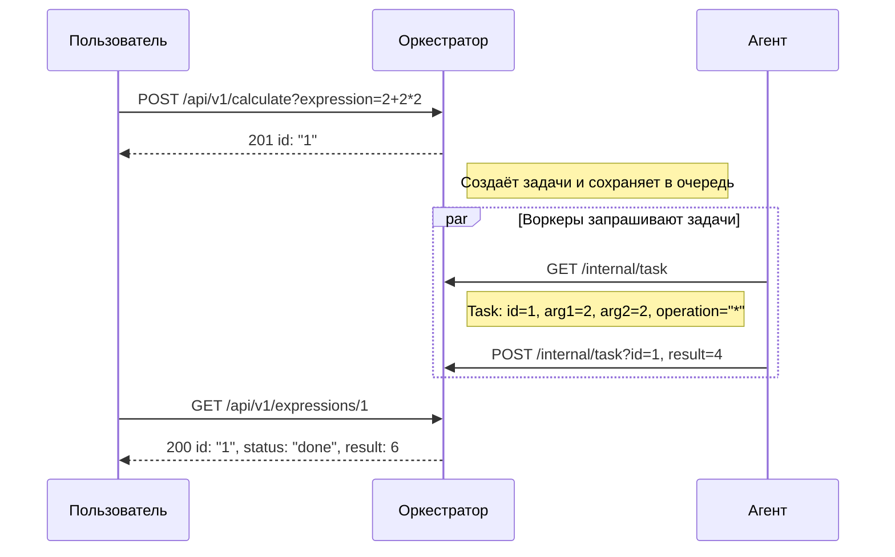
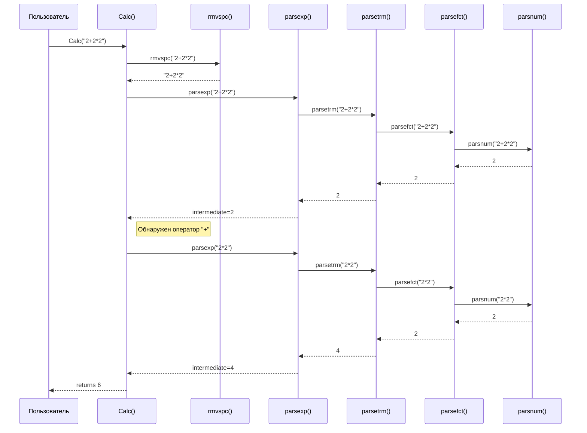
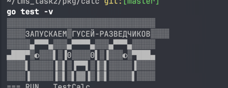

# Распределённый вычислитель арифметических выражений 

[](LICENSE)
[](https://github.com/golkity/Calc_2.0)


## Структура проекта

<pre>
app/
├── cmd
│   ├── agent
│   │   └── main.go
│   └── orchestrator
│       └── main.go
├── config
│   ├── config.json
│   └── config.go
├── internal
│   ├── applicant
│   │   ├── agent_app.go
│   │   └── orchen_app.go
│   ├── agent
│   │   └── agetn.go
│   ├── custom_errors
│   │   └── custom_errors.go
│   ├── http
│   │   ├── handler.go
│   │   └── handler_test.go
│   ├── middleware
│   │   └── middleware.go
│   ├── orchestrator
│   │   └── orchenstrator.go
│   ├── store
│   │   └── store.go
│   └── task
│       └── manager_tasks
│       │   └── struct_manager.go
│       └── manager.go
├── pkg
│   ├── calc
│   │   ├──calc_test.go
│   │   └── calc.go
│   │   
│   └── logger
│       └── logger.go
├── source
│   └── intro.png
├── docker-compose.yml
├── Dockerfile
├── go.mod
├── go.sum
└── README.md
</pre>

## О приложение

>[!IMPORTANT]
> Приложени состоит из двух компонетов:
> - Оркестратор
> - Агент
> - Калькулятор

### **Оркестратор**

- Принимает выражения от пользователя (через `POST /api/v1/calculate`).
- Разбивает (при необходимости) выражение на задачи.
- Хранит задачи в очереди, ожидающие обработки.
- Предоставляет задачи агенту по запросу `GET /internal/task`.
- Принимает результаты вычислений (через `POST /internal/task`).
- Собирает и возвращает конечный результат по `GET /api/v1/expressions` (и `GET /api/v1/expressions/:id`).

## Агент

- Запускается с заданным числом воркеров (`COMPUTING_POWER`).
- Каждая горутина (воркер) регулярно спрашивает у оркестратора: «Есть ли работа?» (метод `GET /internal/task`).
- Если задача найдена, агент вычисляет её (эмулирует "долгое" вычисление, может "спать" `operation_time`).
- Отправляет результат обратно оркестратору (`POST /internal/task`).
- Повторяет процесс.



>[!NOTE]
> Пользователь вызывает функцию Calc("2+2*2").
> -	Calc() сначала вызывает rmvspc(), чтобы удалить пробелы (здесь строка остаётся такой же).
> -	Затем Calc() вызывает parsexp(), которая начинает разбирать выражение.
> -	Внутри parsexp() вызывается parsetrm(), которая, в свою очередь, вызывает parsefct() и parsnum(), чтобы извлечь число 2.
> -	Результат 2 возвращается обратно по цепочке до parsexp(), где обнаруживается оператор "+".
> -	Далее для правой части выражения вызывается parsexp("2*2"), которая обрабатывается через parsetrm(), parsefct() и parsnum() для получения результата 4.
> -	В итоге Calc() суммирует промежуточные результаты (2 + 4) и возвращает 6.



## ТЕСТЫ??? НОУУ ВЭЭЙ 

>[!IMPORTANT]
> Как их запускать и зачем их есть?
> **Тесты для Handler.go**
> ```shell
> cd internal/http/handler
> go test -v
> ```

НЕ ПУГАЙТЕСЬ, ВЫ СКОРЕЕ ВСЕГО УВИДИТЕ ГУСЕЙ, ОНИ ХОРОШИЕ!!!!



>[!IMPORTANT]
> **Тесты для Calc.go**
> ```shell
> cd pkg/calc
> go test -v
> ```

## Запуск

>[!IMPORTANT]
> **Запуск через Docker 🐳:**
> ```shell
> docker-compose up --build
> ```
> 
> **Запус agent.go**
> ```shell
> cd cmd/agent
> go run main.go
>```
> Запуск orchenstrator.go
> ```shell
> cd cmd/orchenstrator
> go run main.go
> ```

