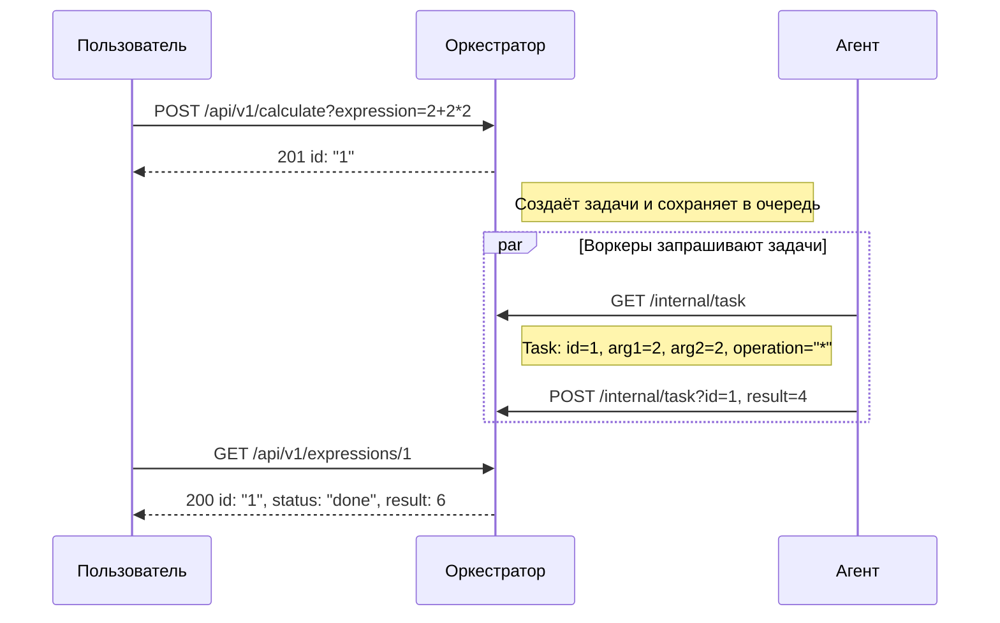
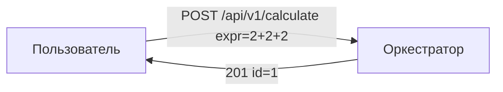
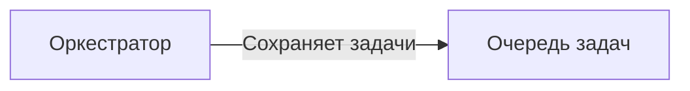
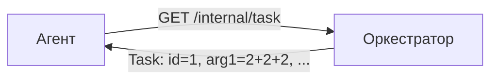
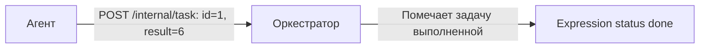
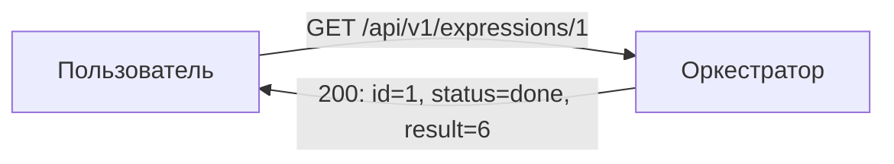
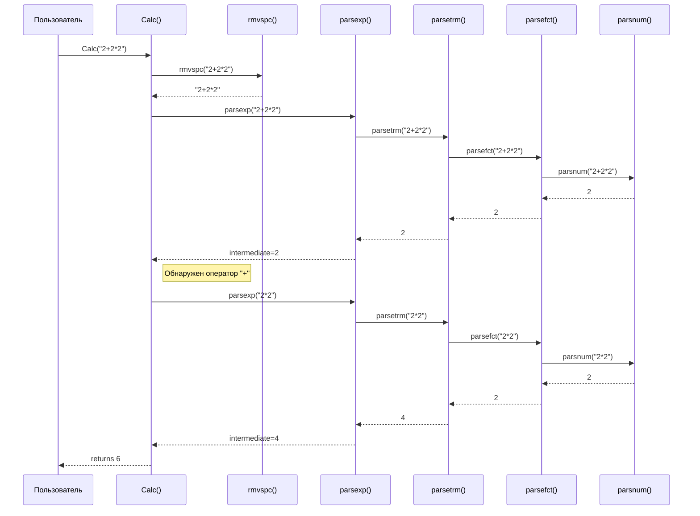

# Распределённый вычислитель арифметических выражений 

[](LICENSE)
[](https://github.com/golkity/Calc_2.0)


## Структура проекта

<pre>
app/
├── cmd
│   ├── agent
│   │   └── main.go
│   └── orchestrator
│       └── main.go
├── config
│   ├── config.json
│   └── config.go
├── internal
│   ├── applicant
│   │   ├── agent_app.go
│   │   └── orchen_app.go
│   ├── agent
│   │   └── agetn.go
│   ├── custom_errors
│   │   └── custom_errors.go
│   ├── http
│   │   ├── handler.go
│   │   └── handler_test.go
│   ├── middleware
│   │   └── middleware.go
│   ├── orchestrator
│   │   └── orchenstrator.go
│   ├── store
│   │   └── store.go
│   └── task
│       └── manager_tasks
│       │   └── struct_manager.go
│       └── manager.go
├── pkg
│   ├── calc
│   │   ├──calc_test.go
│   │   └── calc.go
│   │   
│   └── logger
│       └── logger.go
├── source
│   └── intro.png
├── docker-compose.yml
├── Dockerfile
├── go.mod
├── go.sum
└── README.md
</pre>

## О приложение

>[!IMPORTANT]
> Приложени состоит из двух компонетов:
> - Оркестратор
> - Агент
> - Калькулятор

### **Оркестратор**

- Принимает выражения от пользователя (через `POST /api/v1/calculate`).
- Разбивает (при необходимости) выражение на задачи.
- Хранит задачи в очереди, ожидающие обработки.
- Предоставляет задачи агенту по запросу `GET /internal/task`.
- Принимает результаты вычислений (через `POST /internal/task`).
- Собирает и возвращает конечный результат по `GET /api/v1/expressions` (и `GET /api/v1/expressions/:id`).

## Агент

- Запускается с заданным числом воркеров (`COMPUTING_POWER`).
- Каждая горутина (воркер) регулярно спрашивает у оркестратора: «Есть ли работа?» (метод `GET /internal/task`).
- Если задача найдена, агент вычисляет её (эмулирует "долгое" вычисление, может "спать" `operation_time`).
- Отправляет результат обратно оркестратору (`POST /internal/task`).
- Повторяет процесс.



## Шаг 1. Пользователь отправляет выражение

Пользователь вызывает эндпоинт POST /api/v1/calculate, передавая арифметическое выражение (например, 2+2+2). Оркестратор создаёт запись (Expression) и соответствующие задачи (Tasks) в своей очереди.



1. Пользователь: отправляет JSON вида {"expression":"2+2+2"} на POST /api/v1/calculate.
2.	Оркестратор: возвращает статус 201 и {"id":"1"}, что означает «Выражение принято, ID=1».


## Шаг 2. Оркестратор хранит задачи

Оркестратор может разбить выражение на подзадачи (или создать одну задачу) и хранит их в очереди (или в памяти, БД).



Оркестратор: создаёт структуру Expression{id=1, status=pending}, и задачи вида Task{id=..., arg1=..., operation=..., operation_time=...}.

## Шаг 3. Агент запрашивает задачу

Агент регулярно вызывает GET /internal/task, чтобы получить работу.



Агент: отправляет запрос GET /internal/task.
Оркестратор: отдаёт задачу (200 OK) в JSON (или 404, если задач нет).

## Шаг 4. Агент вычисляет и возвращает результат

Агент берёт задачу, вычисляет результат (скажем, 2+2+2 = 6), потенциально «спит» operation_time мс, а затем отправляет POST /internal/task с итогом.



Агент: POST /internal/task c телом: {"id":1,"result":6}.
Оркестратор:
	1. Находит задачу id=1, ставит done.
	2. Проверяет, все ли задачи для Expression=1 выполнены; если да, Expression.status="done", Expression.result=6.

## Шаг 5. Пользователь получает результат

Теперь пользователь может запросить GET /api/v1/expressions/1 (или посмотреть список /api/v1/expressions), чтобы увидеть статус и итоговое значение.



Пользователь: запрашивает GET /api/v1/expressions/1. 
Оркестратор: возвращает JSON, где status="done" и result=6.

>[!IMPORTANT]
> Что такое воркеры и как они работают?
>
>
>В коде агента реализован механизм параллельных «воркеров»:
>	1.	При запуске функции Start() агент считывает из переменной окружения COMPUTING_POWER число воркеров (cp).
>	2.	Каждый воркер запускается в отдельной горутине (см. go func(workerID int) { ... }).
>	3.	В цикле каждый воркер выполняет:
>	•	getTask() — отправляет запрос GET /internal/task к Оркестратору, пытаясь получить задачу.
>	•	Если задачи нет (404 Not Found), воркер делает time.Sleep(2 * time.Second) и снова пытается получить задачу.
>	•	Если задача есть, воркер:
>	1.	Вычисляет выражение с помощью функции calc.Calc(...).
>	2.	Ждёт время, указанное в OperationTime (эмуляция «сложности» вычислений или иных затрат).
>	3.	Отправляет результат обратно (метод sendResult(...)).
>	4.	Спит 1 секунду и возвращается в начало цикла.
>	4.	Все воркеры работают независимо и параллельно, позволяя агенту обрабатывать несколько задач одновременно.
> 

>[!NOTE]
> Пользователь вызывает функцию Calc("2+2*2").
> -	Calc() сначала вызывает rmvspc(), чтобы удалить пробелы (здесь строка остаётся такой же).
> -	Затем Calc() вызывает parsexp(), которая начинает разбирать выражение.
> -	Внутри parsexp() вызывается parsetrm(), которая, в свою очередь, вызывает parsefct() и parsnum(), чтобы извлечь число 2.
> -	Результат 2 возвращается обратно по цепочке до parsexp(), где обнаруживается оператор "+".
> -	Далее для правой части выражения вызывается parsexp("2*2"), которая обрабатывается через parsetrm(), parsefct() и parsnum() для получения результата 4.
> -	В итоге Calc() суммирует промежуточные результаты (2 + 4) и возвращает 6.



## Какие бывают запросы?? :trollface:

>[!TIP]
> 201 (OK) <- выражение принято для вычисления
> ```shell
> curl --location 'localhost:8080/api/v1/calculate' \
> --header 'Content-Type: application/json' \
> --data '{
>    "expression": "2+2"
>  }'
> ```
> 
> Ответ:
> ```shell
> { 
>   "id":"1"
> }
>```
> 200 (OK) <- успешно получен список выражений
> ```shell
> curl --location 'localhost:8080/api/v1/expressions'
> ```
> 
> Ответ:
> ```shell
> {
>   "expressions": [ 
>        {
>          "id":"1",
>          "result":4,
>          "status":"done"
>        }
>    ]
> }
> ```
> 
> 200 (ОК) <- успешно получено выражение
> ```shell
> curl --location 'localhost:8080/api/v1/expressions/1'
> ```
> 
> Ответ:
> ```shell
> {
>    "expression": {
>           "id":"1",
>           "result":4,
>           "status":"done"
>    }
> }
> ```
> 
> 200 (OK)
> 
> ```shell
> curl --location 'http://localhost:8080/internal/task' \
> --header 'Content-Type: application/json' \
> --data '{
>     "id": 1,
>     "result": 2.5
> }'
> ```
> 
> Ответ:
> ```shell
> {"message":"Result saved successfully"}
> ```

>[!CAUTION]
> 422 <- невалидные данные
> 
> ```shell
> curl --location 'http://localhost:8080/api/v1/calculate' \
> --header 'Content-Type: application/json' \
> --data '{"expression": }'
> ```
>
> Ответ:
> ```shell
> Invalid request body
> ```
>
> 500 <- что-то пошло не так
> ```shell
> curl --location 'localhost:8080/api/v1/calculate' \
> --header 'Content-Type: application/json' \
> --data '{
>   "expression": "2+z"
> }'
> ```
> 
> Ответ:
> 
> ```shell
> {"id":"1"}
> ```
> Но при вызове curl --location 'localhost:8080/api/v1/expressions'
> ```shell
> {"expressions":[{"id":"1","result":null,"status":"pending"}]}
> ```
> Мы получаем тело ответа, но без результата -> 500
> 
> 404 <- нет такого выражения
> 
> ```shell
> curl --location 'localhost:8080/api/v1/expressions/-10'
> ```
> 
> Ответ:
> ```shell
> Expression not found: not found
> ```

## ТЕСТЫ??? НОУУ ВЭЭЙ 

>[!IMPORTANT]
> Как их запускать и зачем их есть?<br>
> **Тесты для Handler.go**
> ```shell
> cd internal/http/handler
> go test -v
> ```

НЕ ПУГАЙТЕСЬ, ВЫ СКОРЕЕ ВСЕГО УВИДИТЕ ГУСЕЙ, ОНИ ХОРОШИЕ!!!!


>[!IMPORTANT]
> **Тесты для Calc.go**
> ```shell
> cd pkg/calc
> go test -v
> ```
>
>**Тесты для agent.go**
> ```shell
> cd internal/agent
> go test -v
> ```
>
>**Тесты для orchenstrator.go**
> ```shell
> cd internal/orchenstrator
> go test -v
> ```

## Запуск

>[!IMPORTANT]
> **Запуск через Docker 🐳:**
> ```shell
> docker-compose up --build
> ```
> 
> **Запус agent.go**
> ```shell
> cd cmd/agent
> go run main.go
>```
> Запуск orchenstrator.go
> ```shell
> cd cmd/orchenstrator
> go run main.go
> ```


<pre>
UPD:
Спасибо всем тем, кто скинет мою репозитори, как свою в лицее :)))))
</pre>