# Распределённый вычислитель арифметических выражений 

[](LICENSE)
[](https://github.com/golkity/YandexGo)


## Структура проекта

<pre>
app/
├── cmd
│   ├── agent
│   │   └── main.go
│   └── orchestrator
│       └── main.go
├── config
│   ├── config.json
│   └── config.go
├── internal
│   ├── applicant
│   │   ├── agent_app.go
│   │   └── orchen_app.go
│   ├── agent
│   │   └── agetn.go
│   ├── custom_errors
│   │   └── custom_errors.go
│   ├── http
│   │   ├── handler.go
│   │   └── handler_test.go
│   ├── middleware
│   │   └── middleware.go
│   ├── orchestrator
│   │   └── orchenstrator.go
│   ├── store
│   │   └── store.go
│   └── task
│       └── manager_tasks
│       │   └── struct_manager.go
│       └── manager.go
├── pkg
│   ├── calc
│   │   ├──calc_test.go
│   │   └── calc.go
│   │   
│   └── logger
│       └── logger.go
├── source
│   └── intro.png
├── docker-compose.yml
├── Dockerfile
├── go.mod
├── go.sum
└── README.md
</pre>

## О приложение

>[!IMPORTANT]
> Приложени состоит из двух компонетов:
> - Оркестратор
> - Агент

### **Оркестратор**

- Принимает выражения от пользователя (через `POST /api/v1/calculate`).
- Разбивает (при необходимости) выражение на задачи.
- Хранит задачи в очереди, ожидающие обработки.
- Предоставляет задачи агенту по запросу `GET /internal/task`.
- Принимает результаты вычислений (через `POST /internal/task`).
- Собирает и возвращает конечный результат по `GET /api/v1/expressions` (и `GET /api/v1/expressions/:id`).

## Агент

- Запускается с заданным числом воркеров (`COMPUTING_POWER`).
- Каждая горутина (воркер) регулярно спрашивает у оркестратора: «Есть ли работа?» (метод `GET /internal/task`).
- Если задача найдена, агент вычисляет её (эмулирует "долгое" вычисление, может "спать" `operation_time`).
- Отправляет результат обратно оркестратору (`POST /internal/task`).
- Повторяет процесс.

```mermaid
sequenceDiagram
    participant U as Пользователь
    participant O as Оркестратор
    participant A as Агент

    %% Шаг 1. Пользователь отправляет выражение
    U->>O: POST /api/v1/calculate\nexpression: "2+2+2"
    O-->>U: 201 id: "1"

    %% Шаг 2. Оркестратор создаёт задачи и сохраняет их в очередь
    O->>O: Создаёт задачи и сохраняет в очередь

    %% Шаг 3. Агент (несколько воркеров) запрашивает задачу
    par Воркеры запрашивают задачу
       A->>O: GET /internal/task
       O-->>A: Task: id=1, arg1="2+2+2", ...
    and
       A->>O: POST /internal/task\nid: 1, result: 6
       O->>O: Обновляет статус задачи и выражения
    end

    %% Шаг 4. Пользователь запрашивает результат
    U->>O: GET /api/v1/expressions/1
    O-->>U: 200 id: "1", status: "done", result: 6
```




## Запуск

>[!IMPORTANT]
> **Запуск через Docker 🐳:**
> ```shell
> docker-compose up --build
> ```
> 
> **Запус agent.go**
> ```shell
> cd cmd/agent
> go run main.go
>```
> Запуск orchenstrator.go
> ```shell
> cd cmd/orchenstrator
> go run main.go
> ```

