# Распределённый вычислитель арифметических выражений (ФИНАЛЬНЫЙ ПРОЕКТ ЯНДЕКС ЛИЦЕЯ) :(
# просьба пока не проверять, +- сутки и я все доделаю, если что, то пишите в тг(в профиле гх есть)


[](LICENSE)
[](https://github.com/golkity/Calc_2.0)


## Структура проекта

<pre>
Calc_2.0/
├── infostructure/               
│   ├── docker/                    
│   │   └── create-postgres-databases.sh
│   ├── kafka-data/                
│   ├── kui-data/                
│   ├── postgres-data/ …         
│   ├── redis-data/               
│   ├── zk-data/                  
│   ├── zk-txn-logs/             
│   ├── .env                      
│   ├── .example.env            
│   ├── .gitignore                 
│   └── docker-compose.yml                   
│
├── internal/                        
│   ├── custom_errors/
│   │   └── custom_errors.go
│   ├── middleware/
│   │   └── middleware.go
│   ├── store/
│   │   └── store.go
│   └── task/
│       └── manager.go
│
├── pkg/                             
│   ├── calc/
│   │   ├── calc.go
│   │   ├── calc_test.go
│   │   └── calc_test.yaml
│   ├── logger/
│   │   └── logger.go
│   └── tokens/
│       └── manager.go
│
├── service/                          
│   ├── api-gateway/
│   │   ├── Dockerfile
│   │   ├── cmd/main.go
│   │   ├── go.mod | go.sum
│   │   ├── handler/
│   │   │   ├── calculate.go
│   │   │   ├── get_exp.go
│   │   │   └── healthz.go
│   │   ├── kafka/producer.go
│   │   └── middleware/auth.go
│   │
│   ├── auth/
│   │   ├── Dockerfile
│   │   ├── cmd/main.go
│   │   ├── go.mod | go.sum
│   │   ├── internal/
│   │   │   ├── config/config.go
│   │   │   ├── db/postgres.go
│   │   │   ├── http/
│   │   │   │   ├── handler/{handler.go,http_mid.go}
│   │   │   │   ├── routes/routes.go
│   │   │   │   └── server.go
│   │   │   ├── kafka/producer.go
│   │   │   ├── models/user.go
│   │   │   └── tokens/{jwt.go,redis_store.go}
│   │   └── migrations/001_init_schema.sql
│   │
│   ├── calc-orchenstrator/
│   │   ├── Dockerfile
│   │   ├── cmd/main.go
│   │   ├── go.mod | go.sum
│   │   ├── kafka/{consumer.go,producer.go}
│   │   ├── orchenstrator/orchenstrator.go
│   │   └── repository/{expression_pg.go,task_pg.go}
│   │
│   └── calc-worker/
│       ├── Dockerfile
│       ├── cmd/main.go
│       ├── go.mod | go.sum
│       ├── kafka/{consumer.go,producer.go}
│       └── worker/work.go
│
├── source/                          
│   ├── final_logoYL.png
│   ├── img.png
│   ├── logger.png
│   ├── logo_int.png
│   ├── logo_out.png
│   ├── outro.png
│   └── worker.jpg
│
├── LICENSE
└── Readme.md
</pre>

Ниже показана топология микросервисов, поднимаемых через `docker-compose`:


## О приложение

>[!IMPORTANT]
> ### **Auth-Service**
> 	- POST /register – регистрация нового пользователя
>	- POST /login – выдача JWT (access + refresh)
>	- POST /refresh – обновление access-токена
>	- GET /healthz – проверка «здоровья» сервиса
>	- Хранит пользователей в PostgreSQL и рефреш-токены в Redis
> ### **API-Gateway**
>	- GET /healthz – проверяет доступность Kafka
>	- POST /api/v1/calculate – принимает выражение, валидирует его, сохраняет в БД, публикует задачу в Kafka и возвращает { "id": … }
>	- При синтаксической ошибке в выражении – 500 Internal Server Error
>	- GET /api/v1/expressions – возвращает список всех выражений пользователя
>	- GET /api/v1/expressions/{id} – возвращает конкретное выражение по ID
> ### **Calc-Orchestrator**
>	- Консьюмер Kafka-топика calc.tasks – получает { user_id, expression }, создаёт запись в Postgres (status=pending)
>	- При необходимости дробит длинные выражения на подзадачи, публикует их обратно в Kafka
>	- Консьюмер Kafka-топика calc.results – получает { expr_id, result }, помечает задачу как выполненную и сохраняет result
> ### **Calc-Worker (Agent)**
>	- Запускается с параллельными воркерами по COMPUTING_POWER
>	- Каждый воркер в цикле:
>	  	- GET /internal/task у Orchestrator
>		- Эмулирует «сложное» вычисление (time.Sleep(operation_time))
>		- Вычисляет результат через pkg/calc.Calc(...)
>		- POST /internal/task с итогом
>		- Повторяет
> ### **Calc (pkg/calc)**
>	- Модуль парсинга и вычисления арифметических выражений
>	- Экспортируемая функция:
>		```go
>		 func Calc(expr string) (float64, error)
>		```


## Шаг 1. Регистрация нового пользователя
Клиент отправляет `POST /register` к Auth-Service:

```bash
curl -i -X POST http://localhost:8080/api/v1/register \
     -H "Content-Type: application/json" \
     -d '{"email":"test@mail.com","password":"MEGASECRETPASSWORDYL"}'
```



```mermaid
flowchart LR
    U[Пользователь] -->|"POST /api/v1/register"| A[Auth-Service]
    A -->|"201 Created"| U
```

## Шаг 2. Логин

Пользователь аутентифицируется в Auth-Service, получая `access_token` и `refresh_token`, которые понадобятся для дальнейших запросов.

```bash
# Выполняем логин и сохраняем access_token
ACCESS_TOKEN=$(curl -s -X POST http://localhost:8080/api/v1/login \
  -H "Content-Type: application/json" \
  -d '{
        "email":    "demo@mail.com",
        "password": "Pa$$w0rd"
      }' \
  | jq -r .access_token)

echo "Access token:" $ACCESS_TOKEN
```



```mermaid
flowchart LR
    U[Пользователь] -->|"POST /api/v1/login \n { email, password }"| A[Auth-Service]
    A -->|"200 OK \n { access_token, refresh_token }"| U
```

## Шаг 3. Отправка выражения на вычисление

С помощью полученного access_token пользователь отправляет арифметическое выражение через API-Gateway. Если выражение валидно – возвращается идентификатор задачи.

```bash
curl -i -X POST http://localhost:8090/api/v1/calculate \
     -H "Authorization: Bearer $ACCESS_TOKEN" \
     -H "Content-Type: application/json" \
     -d '{
           "expression": "2+2*3"
         }'
```



```mermaid
flowchart LR
    U[Пользователь] -->|"POST /api/v1/calculate\n{ expression }"| G[API-Gateway]
    G -->|"200 OK\n{ id }"| U
```

Агент: отправляет запрос GET /internal/task.
Оркестратор: отдаёт задачу (200 OK) в JSON (или 404, если задач нет).

## Шаг 4. Оркестратор сохраняет и распределяет задачи

Что происходит: Calc-Orchestrator читает из Kafka, сохраняет выражение в БД, разбивает на подзадачи и публикует их.

```mermaid
flowchart LR
    G[API-Gateway] -->|"produce calc.tasks"| K[Kafka]
    K -->|"consume calc.tasks"| O[Calc-Orchestrator]
    O -->|"INSERT INTO expressions(status=pending)"| DB[(Postgres)]
    O -->|"produce subtasks (если нужно)"| K
```



## Шаг 5. Пользователь получает результат

Что происходит: Calc-Worker опрашивает оркестратор, вычисляет, отправляет результат.


## Шаг 6. Получение списка выражений

Что происходит: клиент получает все свои выражения через API-Gateway.

```bash
curl -i http://localhost:8090/api/v1/expressions \
     -H "Authorization: Bearer $ACCESS_TOKEN" | jq .
```



```mermaid
flowchart LR
    U[User] -->|"GET /api/v1/expressions"| G[API-Gateway]
    G -->|"200 OK\n{expressions:[…]}"| U
```

## Шаг 7. Получение конкретного выражения по ID

Что происходит: клиент запрашивает статус и результат одного выражения.

```bash
curl -i http://localhost:8090/api/v1/expressions/1 \
     -H "Authorization: Bearer $ACCESS_TOKEN" | jq .
```


>[!IMPORTANT]
> Что такое воркеры и как они работают?
>
>
>В коде агента (`calc-worker`) реализован механизм параллельных «воркеров», который позволяет обрабатывать несколько задач одновременно:
>	1. При запуске функции `Start()` агент считывает из переменной окружения `COMPUTING_POWER` число воркеров (cp).  
>	2. Каждый воркер стартует в собственной горутине:
>   ```go
>      for i := 0; i < cp; i++ {
>           go workerLoop(i)
>       }
>   ```
>	3.	В цикле каждый воркер выполняет:
>	    -	getTask() — отправляет запрос GET /internal/task к Оркестратору, пытаясь получить задачу.
>	    -	Если задачи нет (404 Not Found), воркер делает time.Sleep(2 * time.Second) и снова пытается получить задачу.
>	    -	Если задача есть, воркер:
>	        1.	Вычисляет выражение с помощью функции calc.Calc(...).
>	        2.	Ждёт время, указанное в OperationTime (эмуляция «сложности» вычислений или иных затрат).
>	        3.	Отправляет результат обратно (метод sendResult(...)).
>	        4.	Спит 1 секунду и возвращается в начало цикла.
>	        4.	Все воркеры работают независимо и параллельно, позволяя агенту обрабатывать несколько задач одновременно.
>    
> Все воркеры работают независимо и параллельно, обеспечивая высокую пропускную способность и устойчивость к пиковым нагрузкам.

>[!NOTE]
> Пользователь вызывает функцию Calc("2+2*2").
> -	Calc() сначала вызывает rmvspc(), чтобы удалить пробелы (здесь строка остаётся такой же).
> -	Затем Calc() вызывает parsexp(), которая начинает разбирать выражение.
> -	Внутри parsexp() вызывается parsetrm(), которая, в свою очередь, вызывает parsefct() и parsnum(), чтобы извлечь число 2.
> -	Результат 2 возвращается обратно по цепочке до parsexp(), где обнаруживается оператор "+".
> -	Далее для правой части выражения вызывается parsexp("2*2"), которая обрабатывается через parsetrm(), parsefct() и parsnum() для получения результата 4.
> -	В итоге Calc() суммирует промежуточные результаты (2 + 4) и возвращает 6.


## Какие бывают запросы?? :trollface:

>[!TIP]
> 201 (Created) <- пользователь зарегестрирован в базе данных
> ```shell
> ACCESS_TOKEN=$(curl -s -X POST http://localhost:8080/api/v1/registration \
>  -H "Content-Type: application/json" \
>  -d '{
>        "email":    "demo@mail.com",
>        "password": "Pa$$w0rd"
>      }' \
>  | jq -r .access_token)
>
>echo "Access token:" $ACCESS_TOKEN
> ```
> 
> Ответ:
> 
>
> 200 (OK) <- успешный вход
> ```shell
> ACCESS_TOKEN=$(curl -s -X POST http://localhost:8080/api/v1/login \
>  -H "Content-Type: application/json" \
>  -d '{
>        "email":    "demo@mail.com",
>        "password": "Pa$$w0rd"
>      }' \
>  | jq -r .access_token)
>
>echo "Access token:" $ACCESS_TOKEN
> ```
> 
> Ответ:
> 
> 
> 200 (ОК) <- успешно получено выражение
> ```shell
> curl --location 'localhost:8080/api/v1/expressions/1'
> ```
> 
> Ответ:
> ```shell
> {
>    "expression": {
>           "id":"1",
>           "result":4,
>           "status":"done"
>    }
> }
> ```
> 
> 200 (OK)
> 
> ```shell
> curl --location 'http://localhost:8080/internal/task' \
> --header 'Content-Type: application/json' \
> --data '{
>     "id": 1,
>     "result": 2.5
> }'
> ```
> 
> Ответ:
> ```shell
> {"message":"Result saved successfully"}
> ```

>[!CAUTION]
> 422 <- невалидные данные
> 
> ```shell
> curl --location 'http://localhost:8080/api/v1/calculate' \
> --header 'Content-Type: application/json' \
> --data '{"expression": }'
> ```
>
> Ответ:
> ```shell
> Invalid request body
> ```
>
> 500 <- что-то пошло не так
> ```shell
> curl --location 'localhost:8080/api/v1/calculate' \
> --header 'Content-Type: application/json' \
> --data '{
>   "expression": "2+z"
> }'
> ```
> 
> Ответ:
> 
> ```shell
> {"id":"1"}
> ```
> Но при вызове curl --location 'localhost:8080/api/v1/expressions'
> ```shell
> {"expressions":[{"id":"1","result":null,"status":"pending"}]}
> ```
> Мы получаем тело ответа, но без результата -> 500
> 
> 404 <- нет такого выражения
> 
> ```shell
> curl --location 'localhost:8080/api/v1/expressions/-10'
> ```
> 
> Ответ:
> ```shell
> Expression not found: not found
> ```

## ТЕСТЫ??? НОУУ ВЭЭЙ 

>[!IMPORTANT]
> Как их запускать и зачем их есть?<br>
> **Тесты для Handler.go**
> ```shell
> cd internal/http/handler
> go test -v
> ```

НЕ ПУГАЙТЕСЬ, ВЫ СКОРЕЕ ВСЕГО УВИДИТЕ ГУСЕЙ, ОНИ ХОРОШИЕ!!!!


>[!IMPORTANT]
> **Тесты для Calc.go**
> ```shell
> cd pkg/calc
> go test -v
> ```
>
>**Тесты для agent.go**
> ```shell
> cd internal/agent
> go test -v
> ```
>
>**Тесты для orchenstrator.go**
> ```shell
> cd internal/orchenstrator
> go test -v
> ```
>**Тесты для config.go**
> ```shell
> cd config
> go test -v
> ```


## Запуск

>[!IMPORTANT]
> **Запуск через Docker 🐳:**
> ```shell
> docker-compose up --build
> ```
> 
> **Запус agent.go**
> ```shell
> cd cmd/agent
> go run main.go
>```
> **Запуск orchenstrator.go**
> ```shell
> cd cmd/orchenstrator
> go run main.go
> ```
>**Git clone**
> ```shell
> git clone https://github.com/golkity/Calc_2.0.git
> ```


<pre>
UPD:
Спасибо всем тем, кто скинет мою репозитори, как свою в лицее :)))))
</pre>


```
CREATE TABLE IF NOT EXISTS users (
    id            SERIAL PRIMARY KEY,
    email         TEXT UNIQUE NOT NULL,
    password_hash TEXT NOT NULL,
    created_at    TIMESTAMPTZ DEFAULT now()
);
```

```
export PGPASSWORD="yan2028yan"                                                 
psql -h localhost -p 5433 -U root -d postgres
```

```
CREATE DATABASE calc;
```

```
CREATE TABLE IF NOT EXISTS expressions (
  id          SERIAL       PRIMARY KEY,
  user_id     BIGINT       NOT NULL REFERENCES users(id),
  expression  TEXT         NOT NULL,
  result      DOUBLE PRECISION,
  status      TEXT         NOT NULL,
  created_at  TIMESTAMPTZ  NOT NULL DEFAULT now(),
  updated_at  TIMESTAMPTZ  NOT NULL DEFAULT now()
);
```


```
docker exec -i infostructure-postgres-1 psql \
  -U root \
  -d calc \
  < ../service/auth/migrations/001_init_schema.sql

docker exec -i infostructure-postgres-1 psql \
  -U root \
  -d calc \
  < ../service/auth/migrations/002_create_expressions.sql
```